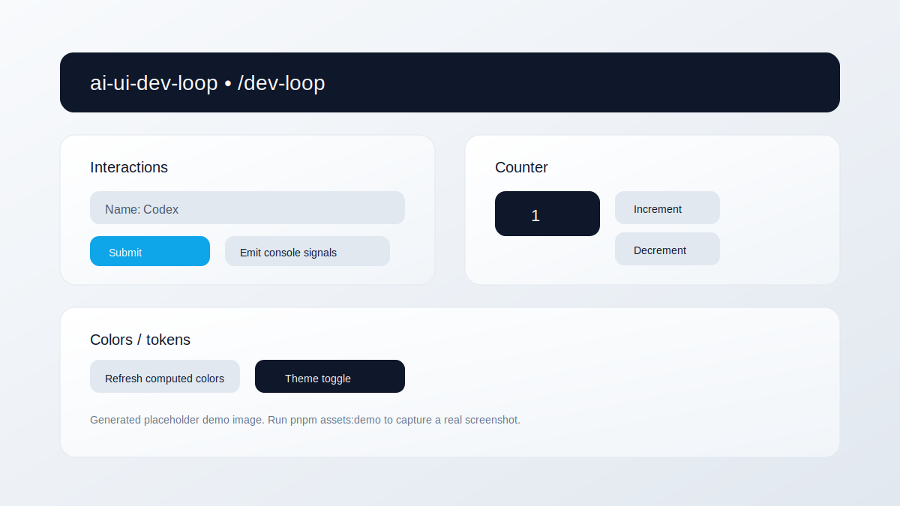

# ai-ui-dev-loop


AI-assisted UI development loop demo using Next.js, shadcn/ui, and Playwright MCP. The `/dev-loop` page is a deterministic surface for automation, console signals, deterministic network probes, and computed color inspection.

<picture>
  <source srcset="docs/assets/dev-loop.png" type="image/png" />
  
</picture>

_Tip: run `pnpm assets:demo` to generate a real screenshot at `docs/assets/dev-loop.png`._

## Live Demo

Public URL: `https://dev-loop-beta.vercel.app`

GitHub Pages explainer: published from `docs/` through `.github/workflows/pages.yml`

Public verification:

1. `pnpm live-demo:doctor`
2. `pnpm live-demo:deploy`
3. `pnpm live-demo:verify -- https://dev-loop-beta.vercel.app`

Healthy public routes:

- `/`
- `/dev-loop`
- `/api/health`

The tracked publication workflow is documented in `docs/live-demo-publication.md`.

## Quickstart

```bash
pnpm activate
```

The activation flow checks dependencies, local app startup, Playwright readiness, and MCP or fallback availability.

Expected checkpoints:
- `dependency-ready`
- `app-ready`
- `playwright-ready`
- `mcp-ready` or `fallback-ready`

The deterministic local target is `http://127.0.0.1:3000/dev-loop`.

## First-Run Activation

Use the repo-owned activation command first:

```bash
pnpm activate
```

Verification-only mode:

```bash
pnpm doctor:loop
```

If activation reports `READY`, the next commands are:

```bash
pnpm dev
pnpm mcp:verify
```

If activation reports `PARTIAL`, follow the printed next steps before debugging manually.

## Dev Loop Demo

1. Run `pnpm activate`
2. Start the app: `pnpm dev`
3. Visit `http://127.0.0.1:3000/dev-loop`
4. Trigger interactions (submit, network probe, console signals, counter, theme toggle)

Supported observability verification:

```bash
pnpm mcp:verify
```

Compatibility alias:

```bash
pnpm mcp:dev-loop
```

## Project Signals

- **Status:** Public-facing demo project
- **Hosting:** Vercel publication workflow tracked in-repo
- **Platforms:** macOS, Linux (Windows via WSL2)
- **Prereqs:** Node 22.15.1, pnpm 10.20.0
- **Known limitations:** Codex-native Playwright MCP usage remains environment-specific; the repo-owned verification path is the sidecar `pnpm mcp:verify` flow. See `knowledge/browser-feedback-loop.md` for troubleshooting.
- **Validation note:** In sandboxed environments that block local port binding, `pnpm e2e` and `pnpm validate` must be run outside the sandbox.

## Tech Stack

- Next.js (App Router), React, TypeScript
- Tailwind CSS, shadcn/ui, Radix UI
- Playwright E2E + Playwright MCP
- pnpm workspaces

## Repo Layout

<!-- BEGIN REPO TREE -->
```text
ai-ui-dev-loop/
|-- .codex/
|   |-- prompts/
|   |   |-- opsx-apply.md
|   |   |-- opsx-archive.md
|   |   |-- opsx-bulk-archive.md
|   |   |-- opsx-continue.md
|   |   |-- opsx-explore.md
|   |   |-- opsx-ff.md
|   |   |-- opsx-new.md
|   |   |-- opsx-onboard.md
|   |   |-- opsx-sync.md
|   |   `-- opsx-verify.md
|   `-- skills/
|       |-- openspec-apply-change/
|       |-- openspec-archive-change/
|       |-- openspec-bulk-archive-change/
|       |-- openspec-continue-change/
|       |-- openspec-explore/
|       |-- openspec-ff-change/
|       |-- openspec-new-change/
|       |-- openspec-onboard/
|       |-- openspec-sync-specs/
|       `-- openspec-verify-change/
|-- .github/
|   |-- ISSUE_TEMPLATE/
|   |   |-- bug_report.md
|   |   |-- config.yml
|   |   `-- feature_request.md
|   |-- workflows/
|   |   |-- ci.yml
|   |   `-- pages.yml
|   `-- pull_request_template.md
|-- .history/
|   |-- .gitignore_20260114170806
|   |-- .gitignore_20260202231615
|   |-- CODE_OF_CONDUCT_20260202224421.md
|   |-- CODE_OF_CONDUCT_20260202231431.md
|   |-- LICENSE_20260202224356
|   |-- LICENSE_20260202231415
|   |-- SECURITY_20260202224426.md
|   |-- SECURITY_20260202231450.md
|   `-- SECURITY_20260202231453.md
|-- apps/
|   `-- web/
|       |-- .vercel/
|       |-- app/
|       |-- components/
|       |-- e2e/
|       |-- lib/
|       |-- public/
|       |-- scripts/
|       |-- .gitignore
|       |-- components.json
|       |-- eslint.config.mjs
|       |-- next-env.d.ts
|       |-- next.config.ts
|       |-- package.json
|       |-- playwright.config.ts
|       |-- postcss.config.mjs
|       |-- README.md
|       `-- tsconfig.json
|-- docs/
|   |-- assets/
|   |   |-- dev-loop.png
|   |   `-- dev-loop.svg
|   |-- .nojekyll
|   |-- 404.html
|   |-- github-pages.md
|   |-- index.html
|   |-- live-demo-publication.md
|   |-- repo-tree.txt
|   `-- site.css
|-- knowledge/
|   |-- browser-feedback-loop.md
|   `-- codex-playwright-mcp.md
|-- openspec/
|   |-- changes/
|   |   |-- archive/
|   |   `-- publish-github-pages-site/
|   |-- specs/
|   |   |-- ai-browser-feedback-loop/
|   |   |-- ci-test-pipeline/
|   |   |-- fresh-clone-activation/
|   |   |-- live-demo-publication/
|   |   |-- repo-readiness/
|   |   `-- web-ui-template/
|   |-- config.yaml
|   `-- project.md
|-- scripts/
|   |-- activate-ai-loop.mjs
|   |-- generate-repo-tree.mjs
|   `-- live-demo.mjs
|-- .editorconfig
|-- .gitignore
|-- .nvmrc
|-- .tool-versions
|-- AGENTS.md
|-- CHANGELOG.md
|-- CODE_OF_CONDUCT.md
|-- CONTRIBUTING.md
|-- Justfile
|-- LICENSE
|-- package.json
|-- pnpm-lock.yaml
|-- pnpm-workspace.yaml
|-- README.md
`-- SECURITY.md
```
<!-- END REPO TREE -->

## Automation

```bash
pnpm activate      # bootstrap and verify the local AI/browser loop
pnpm doctor:loop   # verification-only readiness report
pnpm live-demo:doctor
pnpm live-demo:deploy
pnpm live-demo:verify -- https://dev-loop-beta.vercel.app
pnpm mcp:verify    # run the supported sidecar MCP observability verifier
pnpm mcp:dev-loop  # compatibility alias for pnpm mcp:verify
pnpm assets:demo   # capture README demo screenshot (requires mcp-server-playwright)
pnpm assets:tree   # regenerate repo layout section in README
pnpm assets:all    # run both
```

See `knowledge/codex-playwright-mcp.md` for installing and configuring `mcp-server-playwright`.

## Validation

```bash
pnpm activate
pnpm build
pnpm lint
pnpm e2e
pnpm validate
pnpm mcp:verify
```

## CI

GitHub Actions runs lint, production build, and Playwright E2E checks on pull requests and pushes to the default branch.

## Docs

- `knowledge/browser-feedback-loop.md` (Playwright MCP troubleshooting)
- `knowledge/codex-playwright-mcp.md` (Codex + Playwright MCP setup)
- `docs/github-pages.md` (GitHub Pages explainer setup and activation note)
- `docs/live-demo-publication.md` (Vercel publication + public verification workflow)

## Contributing

See `CONTRIBUTING.md`.

## License

MIT. See `LICENSE`.
